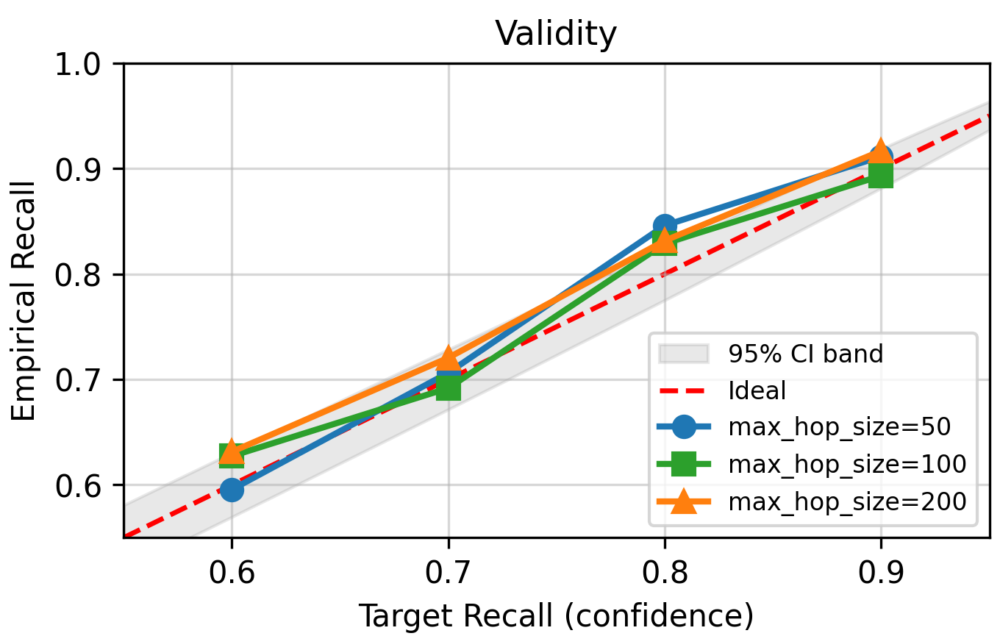
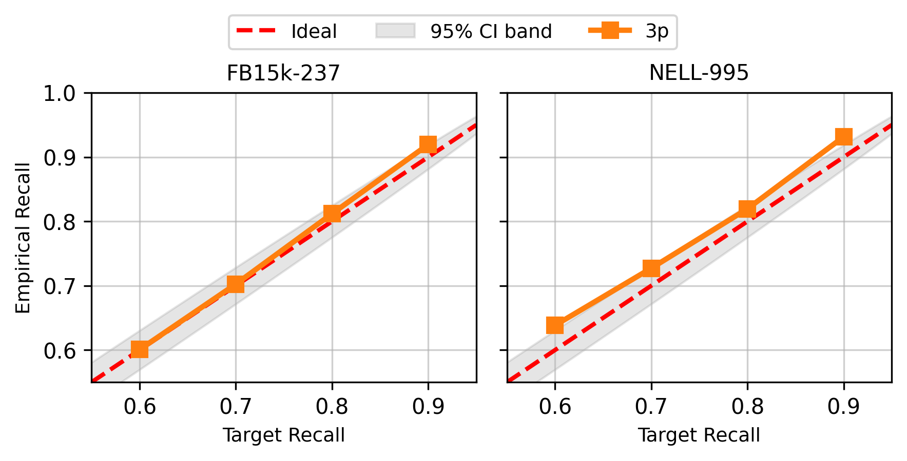
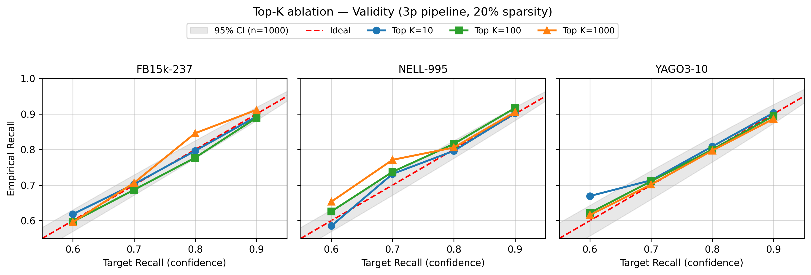
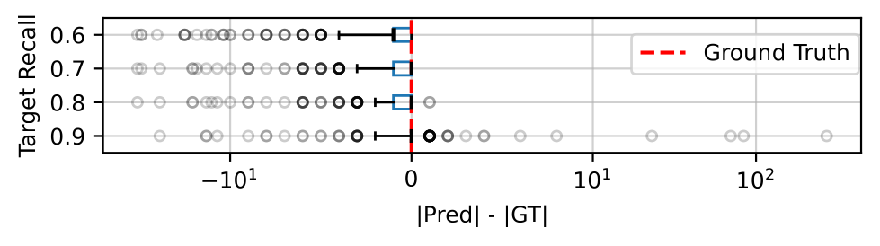
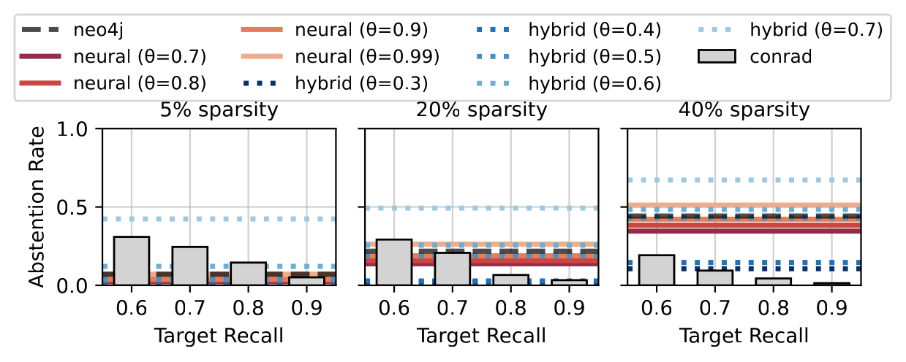

# ConRAD: Supplementary Results
 
This document contains additional ablation studies and analyses referenced in the paper. All experiments use the same setup described in Section 6.1 unless otherwise noted.
 
---
 
## 1. Frontier Cap Ablation (max_hop_size)
 
The main experiments restrict calibration and evaluation to queries with intermediate ground-truth frontiers |Y^(i)| <= 50, due to the memory overhead of materializing |Y^(i)| × |V| score matrices on the GPU. To verify that ConRAD's guarantees and precision are not artifacts of this ceiling, we re-ran the full pipeline (calibration and evaluation) on FB15k-237 3p at 20% sparsity with the per-hop frontier cap raised to 100 and 200.
 
### Figure A: Validity under different frontier caps
 
<!--  -->

<em>Validity of ConRAD under different intermediate frontier caps (50, 100, 200) on FB15k-237 3p at 20% sparsity. Empirical recall tracks the target within the 95% CI band at all caps.</em>

 
### Table A: Calibration time and precision at each target recall
 

| max_hop_size | Calibration (min) | Prec @ 0.6 | Prec @ 0.7 | Prec @ 0.8 | Prec @ 0.9 |
|:---:|:---:|:---:|:---:|:---:|:---:|
| 50 | 38.00 | 0.71 | 0.78 | 0.93 | 0.96 |
| 100 | 100.98 | 0.73 | 0.76 | 0.92 | 0.92 |
| 200 | 257.88 | 0.77 | 0.83 | 0.94 | 0.97 |

 
**Key findings:**
 
- **Validity is unaffected.** The empirical recall curve tracks the target within the 95% CI band at each cap. The CRC guarantee is not an artifact of the original 50-cap.
- **Precision does not degrade.** At target recall 0.6, precision moves from 0.71 (cap=50) to 0.73 (cap=100) to 0.77 (cap=200); at target 0.7, from 0.78 to 0.76 to 0.83. This increase can be justified as follows: larger frontiers expose more true-positive candidates per hop, so the calibrator can satisfy the recall constraint with relatively tighter thresholds, therefore yielding smaller, cleaner result sets. The high precision reported in Tab. 3 in the paper is therefore not a small-query artifact.
- **Calibration cost grows super-linearly** (from 38 to 101 to 258 minutes for caps 50, 100, and 200, respectively). We retained cap=50 for the main experiments to keep calibration tractable across the full evaluation grid.
---
 
## 2. Non-Uniform (Stratified) Edge Deletion
 
Uniform random edge removal is the standard incompleteness protocol used across the neural KG reasoning literature. To test ConRAD under a more realistic non-uniform deletion strategy, we implement a stratified deletion procedure. Since real-world KG incompleteness tends to concentrate in long-tail regions, we bin edges by the degree of their less-connected endpoint and delete a higher fraction from low-degree bins than from high-degree bins. The overall deletion rate (20%) matches the uniform setting. The procedure is applied to both the calibration and the evaluation graphs.
 
### Figure B: Validity under stratified edge deletion
 
<!--  -->

 

<em>Validity of ConRAD under stratified (non-uniform) edge deletion on FB15k-237 and NELL-995 (3p, 20% overall deletion rate). Empirical recall tracks the target within the 95% CI band.</em>

 
### Table B: Maximum precision subject to target recall >= 0.60
 

| Dataset | neo4j | neural (best θ) | hybrid (best θ) | ConRAD (best α) |
|:---|:---:|:---:|:---:|:---:|
| FB15k-237 | Fails (0.45) | Fails (0.54) | 0.38 (θ=0.3) | **0.89** (α=0.8) |
| NELL-995 | Fails (0.30) | Fails (0.49) | 0.65 (θ=0.3) | **0.85** (α=0.8) |

 

<em>Stratified edge deletion, 3p topology, 20% overall deletion rate.</em>

 
**Key findings:**
 
- ConRAD continues to satisfy the target recall, while the static baselines degrade sharply.
- The neo4j and neural baselines fail to reach 60% recall on either dataset; the hybrid baseline reaches it only with low precision (0.38 / 0.65).
- ConRAD achieves 0.89/0.85 precision, which is a a 20 to 50 percentage point improvement over the best static baseline.
- The widening gap reflects the conformal gate's adaptivity: when incompleteness is concentrated in long-tail neighborhoods, static thresholds cannot compensate, whereas the conformal gate invokes inference selectively where retrieval evidence is sparse.
---
 
## 3. Calibration-Time Candidate Pool Ablation (Top-K)
  
During calibration, we restrict intermediate propagation to the union of ground-truth entities and the top-K highest-scoring neural candidates per hop. To verify that the recall guarantee is robust to K, we ran ConRAD calibration at K = 10, 100, 1000 on the 3p topology across all three benchmarks at 20% sparsity.
 
**Formal argument:** The calibration set for each query includes all ground-truth entities by construction, plus the top-K highest-scoring neural candidates per hop. K, therefore, controls only the non-ground-truth tail of the candidate pool; ground-truth scores (which anchor the conformal optimization via the FNR loss) are always present, independently of K. Varying K shifts the value of the calibrated threshold lambda_hat by changing the empirical distribution of false-positive scores, but it cannot omit a true positive from the calibration set. The CRC marginal recall guarantee (Eq. 4 in the paper) is therefore preserved at any K >= 0, with K controlling only the precision of the result, not the validity of the guarantee.
 
### Figure C: Validity under different K values
 
<!--  -->

 

<em>Validity of ConRAD under calibration-time pruning at K = 10, 100, 1000 on FB15k-237, NELL-995, and YAGO3-10 (3p, 20% sparsity). Empirical recall tracks the target within the 95% CI band at all (dataset, K) pairs, confirming that the recall guarantee is preserved independently of K.</em>

 
### Table C: Maximum precision subject to recall ≥ 0.60
 

| Dataset | Best Precision | Target Recall | Top-K |
|:---|:---:|:---:|:---:|
| FB15k-237 | 0.9594 | 0.9 | 1000 |
| NELL-995 | 0.9472 | 0.9 | 100 |
| YAGO3-10 | 0.8889 | 0.8 | 10 |

 

<em>Maximum precision subject to empirical recall >= 0.6 under calibration-time pruning at K = {10, 100, 1000} (3p, 20% sparsity). Precision varies by at most 12 percentage points across K at matched α, indicating that K is a precision-tuning parameter.</em>

 
**Key findings:**
 
- **Validity holds at every K, on every dataset.** Empirical recall tracks the declared target within the 95% CI band at all (dataset, K) pairs, including K=10.
- **Precision varies by at most 12 percentage points across K.** The optimal K varies across datasets, suggesting that K is a precision-tuning hyperparameter whose best value depends on the predictor's score distribution on the underlying graph.
- The main experiments use K=1000 as a generous pool that ensures stable quantile estimates across all eight topologies and three datasets.
---
 
## 4. Detailed Latency Analysis
  
Figure 9 in the paper reports end-to-end per-query latency on FB15k-237 3p across three sparsity levels. Below we provide additional details on two observations from the latency results.
 
### Neo4j latency gap
 
At target recall 0.6 under 5% sparsity, ConRAD reports ~55 ms despite Sec. 6.2.3 showing zero inference invocations in this regime, compared to neo4j's ~15 ms. The gap reflects the cost of executing a compositional plan: ConRAD evaluates a per-hop DAG of conformal gates, issuing a separate retrieval call to Neo4j at each hop with score unification (Eq. 9) and set operations in between, whereas Neo4j executes the full multi-hop pattern as a single compiled Cypher query and can optimize across hops internally. When inference is bypassed entirely, this per-hop fragmentation accounts for the ~40 ms gap. Merging consecutive retrieval-only hops into a single Cypher call is a natural engineering optimization that would close most of this gap, which we leave as future work. 
 
### Neural baseline latency clustering
 
The neural baseline's latency clusters tightly across θ within each sparsity level because per-hop scoring cost is dominated by the batched forward pass over input_size × |V| candidate triples (batch size 64). Stricter θ shrinks downstream input sets in principle, but the reduction is small relative to |V| ≈ 14k, so the total number of batched forward passes (and, therefore, the latency) remains nearly constant across the tested θ range.
 
---
 
## 5. Per-Query Cardinality Analysis
  
To confirm that the conformal gate adapts selectivity per query based on local graph density rather than uniformly inflating prediction sets, we analyze the distribution of per-query result set cardinalities.
 
### Figure D: Adaptivity
 
<!--  -->

<em>Per-query cardinality adaptivity (|Pred| - |GT|) on NELL-995 (20% data incompleteness) for ip. The tight clustering around zero at moderate recall targets (0.6-0.7) indicates high precision across most queries. The positive tail at stricter targets shows the system trades off precision for recall on difficult queries.</em>

For each query on NELL-995 at 20% incompleteness, we plot the difference between predicted and ground-truth answer set sizes against the recall target. At moderate targets (0.6-0.7), a substantial fraction of queries cluster tightly around zero, indicating near-perfect precision. As the target increases, the system admits more candidates, trading precision for recall. The positive tail corresponds to queries over severely incomplete local neighborhoods. Here, retrieval yields few edges, and the inference operator produces low-confidence scores, forcing the system to admit more candidates to meet the risk budget. This confirms that ConRAD does not meet its recall targets by uniformly inflating prediction sets, but it adapts selectivity to the local difficulty of each query. We observe consistent behavior across all datasets and query topologies. We report NELL-995 ip for brevity.
 
---
 
## 6. Abstention Rate Analysis
 
**Referenced in:** Section 6.2.2
 
We report the fraction of queries where the system abstains (returns an empty result set), assigned zero precision and zero recall. ConRAD maintains low abstention rates even as incompleteness increases to 40%.
 
 ### Figure E: Abstention Rates against the Baselines
 
<!--  -->

<em>Query abstention rate on FB15k-237 3p. Static baselines abstain on up to 60% of queries at 40% data incompleteness. ConRAD's abstention remains stable.</em>

We examine query abstention. We define Abstention Rate as the fraction of queries producing empty result sets. Figure E tracks the abstention rate for FB15k-237 3p across incompleteness levels. At 5%, abstention is negligible for all baselines. As incompleteness increases to 40%, the static hybrid baselines diverge sharply. Configurations with moderate-to-high thresholds abstain on up to 60% of queries, as fixed thresholds that worked at lower incompleteness become too aggressive. These are silent failures, yielding zero recall on the affected instances. ConRAD's abstention remains substantially lower across all incompleteness levels, staying below 30% even at 40% data incompleteness compared to up to 60% for the static baselines. Because abstention contributes zero recall to the expected risk, the CRC optimization inherently steers away from threshold vectors that produce empty results. Abstention does rise slightly at relaxed recall targets (e.g., 29.2% at target 0.6 vs. 3.3% at target 0.9 under 40% incompleteness). This is a side effect of the cardinality objective. A generous risk budget allows tighter thresholds that produce smaller prediction sets, which can yield empty results on the hardest queries. At strict recall targets, the optimizer cannot tolerate such abstentions and selects more permissive thresholds accordingly.